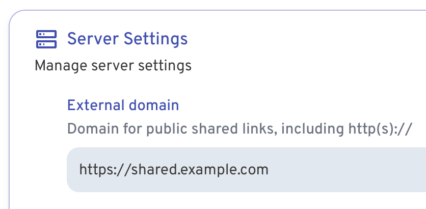

# Immich Public Proxy

Share your Immich photos and albums in a safe way without exposing your Immich instance to the public.

<p align="center" width="100%">

</p>

Immich is a wonderful bit of software, but since it holds all your private photos it's best to keep it fully locked down.
This presents a problem when you want to share a photo or a gallery with someone.

**Immich Public Proxy** provides a barrier of security between the public and Immich, and _only_ allows through requests
which you have publicly shared. When it receives a valid request, it talks to Immich locally via API and returns only
those shared images.

It exposes no ports, allows no incoming data, and has no API to exploit.

The ideal setup is to have Immich secured privately behind VPN or mTLS, and only allow public access to Immich Public Proxy.

[Live demo](https://immich-demo.note.sx/share/ffSw63qnIYMtpmg0RNvOui0Dpio7BbxsObjvH8YZaobIjIAzl5n7zTX5d6EDHdOYEvo)

## How to install with Docker

1. Clone the repo:

```bash
git clone https://github.com/alangrainger/immich-public-proxy.git
```

2. Create a `.env` file to configure the app.

```
IMMICH_URL=http://localhost:2283
PORT=3000
CACHE_AGE=2592000
```

- `IMMICH_URL` is the URL to access Immich in your local network. This is not your public URL.
- `CACHE_AGE` this is setting the `cache-control` header, to tell the browser to cache the assets. Set to 0 to disable caching.

3. Start the docker container:

```bash
docker-compose up -d
```

4. Set the "External domain" in your Immich **Server Settings** to be the same as the public URL for your Immich Public Proxy:



Now whenever you share an image or gallery through Immich, it will automatically create the
correct public path for you.

## How it works

You share your photos/videos as normal through Immich. Because you have set the **External domain** in Immich settings
to be the URL for your proxy app, the links that Immich generates will automaticaly have the correct URL.

When the proxy receives a request, it will come as a link like this:

```
https://your-proxy-url.com/share/ffSw63qnIYMtpmg0RNvOui0Dpio7BbxsObjvH8YZaobIjIAzl5n7zTX5d6EDHdOYEvo
```

The part after `/share/` is Immich's shared link public ID (called the `key` [in the docs](https://immich.app/docs/api/get-all-shared-links/)).

**Immich Public Proxy** takes that key and makes an API call to your Immich instance over your local network, to ask what 
photos or videos are shared in that share URL.

If it is a valid share URL, the proxy fetches just those assets via local API and returns them to the visitor as an 
individual image or gallery.

If the shared link is expired or any of the assets have been put in the Immich trash, it will not return those.

## Configuration

The gallery is created using [lightGallery](https://github.com/sachinchoolur/lightGallery). You can change various settings to change how your gallery displays by
updating the `lightGallery` section in `/views/gallery.ejs`:

```javascript
lightGallery(document.getElementById('lightgallery'), {
  plugins: [lgZoom, lgThumbnail, lgVideo, lgFullscreen],
  speed: 500
})
```

For example to disable the download button for images, you would add `download: false`:

```javascript
lightGallery(document.getElementById('lightgallery'), {
  plugins: [lgZoom, lgThumbnail, lgVideo, lgFullscreen],
  download: false,
  speed: 500
})
```

You can find all of lightGallery's settings here:

https://www.lightgalleryjs.com/docs/settings/

## Feature requests

You can [add feature requests here](https://github.com/alangrainger/immich-public-proxy/discussions/categories/feature-requests?discussions_q=is%3Aopen+category%3A%22Feature+Requests%22+sort%3Atop),
however my goal with this project is to keep it as lean as possible. 

Due to the sensitivity of data contained within Immich, I want anyone with a bit of coding knowledge
to be able to read this codebase and fully understand everything it is doing.
