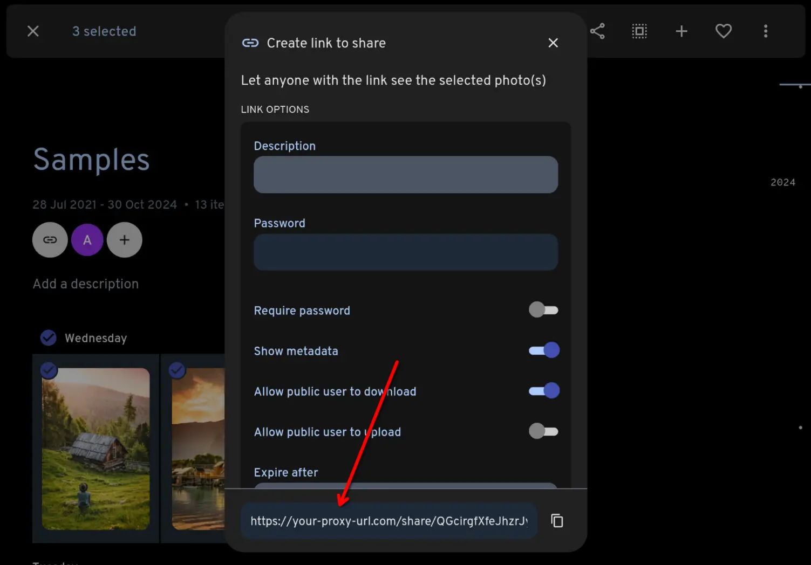
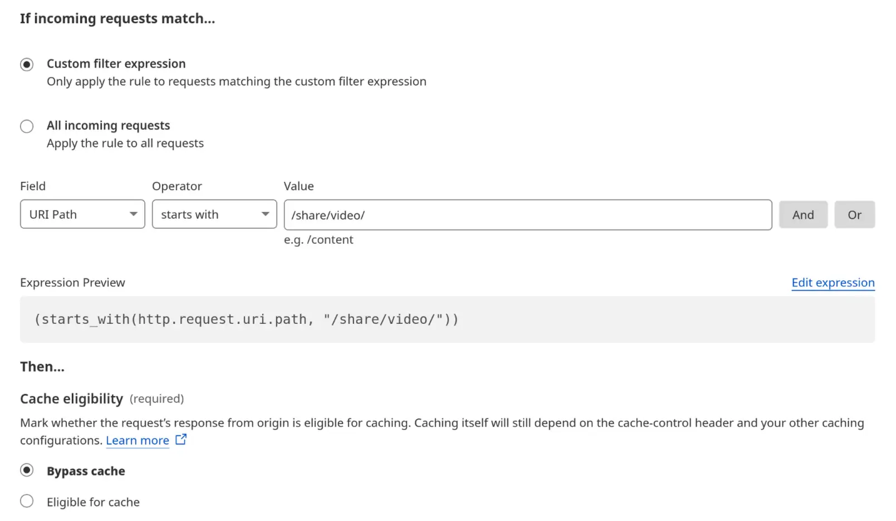

# Immich Public Proxy

<p align="center" width="100%">
<a href="https://hub.docker.com/r/alangrainger/immich-public-proxy/tags">
    </a>
<a href="https://github.com/alangrainger/immich-public-proxy/releases/latest">
    </a>
<a href="https://immich-demo.note.sx/share/gJfs8l4LcJJrBUpjhMnDoKXFt1Tm5vKXPbXl8BgwPtLtEBCOOObqbQdV5i0oun5hZjQ"></a>
</p>

Share your Immich photos and albums in a safe way without exposing your Immich instance to the public.

Setup takes less than a minute, and you never need to touch it again as all of your sharing stays managed within Immich.

<p align="center" width="100%">

</p>

### Table of Contents

- [About this project](#about-this-project)
- [Install with Docker](#installation)
- [How to use it](#how-to-use-it)
- [How it works](#how-it-works)
- [Additional configuration](#additional-configuration)
- [Troubleshooting](#troubleshooting)
- [Feature requests](#feature-requests)

## About this project

[Immich](https://github.com/immich-app/immich) is a wonderful bit of software, but since it holds all your private photos it's 
best to keep it fully locked down. This presents a problem when you want to share a photo or a gallery with someone.

**Immich Public Proxy** provides a barrier of security between the public and Immich, and _only_ allows through requests
which you have publicly shared.

It is stateless and does not know anything about your Immich instance. It does not require an API key which reduces the attack 
surface even further. The only things that the proxy can access are photos that you have made publicly available in Immich. 

See a [Live demo gallery](https://immich-demo.note.sx/share/gJfs8l4LcJJrBUpjhMnDoKXFt1Tm5vKXPbXl8BgwPtLtEBCOOObqbQdV5i0oun5hZjQ)
serving straight out of my own Immich instance.

### Features

- Supports sharing photos and videos.
- Supports password-protected shares.
- If sharing a single image, by default the link will directly open the image file so that you can embed it anywhere you would a normal image. (This is configurable.)
- All usage happens through Immich - you won't need to touch this app after the initial configuration.

### Why not simply put Immich behind a reverse proxy and only expose the `/share/` path to the public?

To view a shared album in Immich, you need access to the `/api/` path. If you're sharing a gallery with the public, you need
to make that path public. Any existing or future vulnerability has the potential to compromise your Immich instance.

For me, the ideal setup is to have Immich secured privately behind mTLS or VPN, and only allow public access to Immich Public Proxy.
Here is an example setup for [securing Immich behind mTLS](./docs/securing-immich-with-mtls.md) using Caddy.

## Installation

1. Download the [docker-compose.yml](https://github.com/alangrainger/immich-public-proxy/blob/main/docker-compose.yml) file.

2. Update the value for `IMMICH_URL` in your docker-compose file to point to your local URL for Immich. This should not be a public URL.

3. Start the docker container. You can test that it is working by visiting `https://your-proxy-url.com/healthcheck`. 
Check the container console output for any error messages.

```bash
docker-compose up -d
```

4. Set the "External domain" in your Immich **Server Settings** to be whatever domain you use to publicly serve Immich Public Proxy:


Now whenever you share an image or gallery through Immich, it will automatically create the correct public path for you.

🚨 **IMPORTANT**: If you're using Cloudflare, please make sure to set your `/share/video/*` path to Bypass Cache, otherwise you may
run into video playback issues. See [Troubleshooting](#troubleshooting) for more information.

### Running on a single domain

Because all IPP paths are under `/share/...`, you can run Immich Public Proxy and Immich on the same domain.

See the instructions here: [Running on a single domain](./docs/running-on-single-domain.md).

## How to use it

Other than the initial configuration above, everything else is managed through Immich.

You share your photos/videos as normal through Immich. Because you have set the **External domain** in Immich settings
to be the URL for your proxy app, the links that Immich generates will automaticaly have the correct URL:



## How it works

When the proxy receives a request, it will come as a link like this:

```
https://your-proxy-url.com/share/ffSw63qnIYMtpmg0RNvOui0Dpio7BbxsObjvH8YZaobIjIAzl5n7zTX5d6EDHdOYEvo
```

The part after `/share/` is Immich's shared link public ID (called the `key` [in the docs](https://immich.app/docs/api/get-my-shared-link)).

**Immich Public Proxy** takes that key and makes an API call to your Immich instance over your local network, to ask what
photos or videos are shared in that share URL.

If it is a valid share URL, the proxy fetches just those assets via local API and returns them to the visitor as an
individual image or gallery.

If the shared link has expired or any of the assets have been put in the Immich trash, it will not return those.

All incoming data is validated and sanitised, and anything unexpected is simply dropped with a 404.

## Additional configuration

There are some additional configuration options you can change, for example the way the gallery is set up.

1. Make a copy of [config.json](https://github.com/alangrainger/immich-public-proxy/blob/main/app/config.json) in the same folder as your `docker-compose.yml`.

2. Pass the config to your docker container by adding a volume like this:

```yaml
    volumes:
      - ./config.json:/app/config.json:ro
```

3. Restart your container and your custom configuration should be active.

### Immich Public Proxy options

| Option                  | Description                                                                                                                 |
|-------------------------|-----------------------------------------------------------------------------------------------------------------------------|
| `responseHeaders`       | Change the headers sent with your web responses. By default there is `cache-control` and CORS added.                        |
| `downloadOriginalPhoto` | Set to `false` if you only want people to be able to download the 'preview' quality photo, rather than your original photo. |
| `showGalleryTitle`      | Show a title on the gallery page.                                                                                           |
| `allowDownloadAll`      | Allow visitors to download all files as a zip.                                                                              |

### lightGallery

The gallery is created using [lightGallery](https://github.com/sachinchoolur/lightGallery).
You can find all of lightGallery's settings here:
https://www.lightgalleryjs.com/docs/settings/

For example, to disable the download button for images, you would edit the `lightGallery` section and change `download` to `false`:

```json
{
  "lightGallery": {
    "controls": true,
    "download": false,
    "mobileSettings": {
      "controls": false,
      "showCloseIcon": true,
      "download": false
    }
  }
}
```

## Troubleshooting

If you're using Cloudflare and having issues with videos not playing well, make sure your `/share/video/` paths are set to bypass cache.
I ran into this issue myself, and found [some helpful advice here](https://community.cloudflare.com/t/mp4-wont-load-in-safari-using-cloudflare/10587/48).

<a href="docs/cloudflare-video-cache.webp"></a>

## Feature requests

You can [add feature requests here](https://github.com/alangrainger/immich-public-proxy/discussions/categories/feature-requests?discussions_q=is%3Aopen+category%3A%22Feature+Requests%22+sort%3Atop),
however my goal with this project is to keep it as lean as possible.

Due to the sensitivity of data contained within Immich, I want anyone with a bit of coding knowledge
to be able to read this codebase and fully understand everything it is doing.

Things that not be considered for this project are:

- Anything that modifies Immich or its files in any way. If it requires an API key or privileged accesss, it won't be considered as a new feature.
- Uploading photos (see above).
